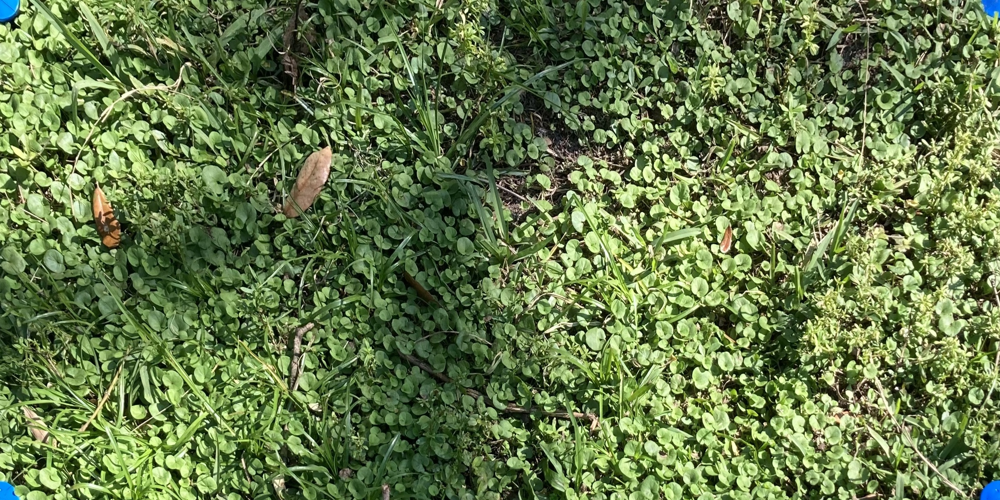

# pgc_coverage
Python code for taking images of perennial groundcover plots mixed in with cash crops and estimate the percentage of PGC coverage within each zone.

# Basic Image processing Pipeline
* Read in image file
* Detect Pantone color correction card using the ARUCO framework
* Make image color corrections as necessary
* Transform the image
    * Workflow 1
        * Identify corner points on the exterior corners of the desired plot
        * Afine shift the image and crop to set size
    * Workflow 2
        * Estimate image pose from Aruco card
        * Affine shift the image and crop to set size from corner points
* Reduce image complexity by clustering similar pixels together
    * K-means
    * SLIC
    * Others?
* Generate ROI Mask
* Threshold image to get masks for green zones within ROI
* Split ROI into equal zones
* Calculate proportion of pixels in each zone corresponding to green cover
* Further ideas
    * Generate images of zones with actual groundcover for output
    * Get average rgb values (or HSV) for each zone to determine greenness of PGCs

## Done
* Blue marker detection
* image transform

## To Do
* Refactor marker identification code
* Transform image code

## Examples
Here is a masked and transformed plot image

And then after it has been backtransformed and overlaid onto the original image

Here is one more example

And then overlaid

